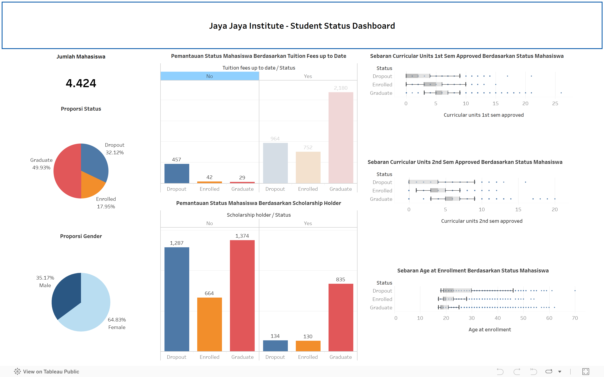

# Proyek Akhir: Menyelesaikan Permasalahan Perusahaan Edutech

- **Nama:** Sofi Zamzanah
- **Email Dicoding:** zamzanahsofi@gmail.com 
- **Email Laskar:** a406xbm467@devacademy.id
- **ID Dicoding:** sofiznh

## Business Understanding

Jaya Jaya Institut, yang telah berdiri sejak tahun 2000, dikenal sebagai institusi pendidikan tinggi dengan reputasi baik dan banyak lulusan berkualitas. Namun, angka dropout mahasiswa yang masih tinggi menjadi tantangan serius karena dapat merusak citra institusi, menurunkan akreditasi, dan mengurangi kepercayaan publik. Untuk itu, diperlukan sistem monitoring akademik yang terstruktur dan penerapan machine learning guna menganalisis potensi dropout secara dini. Hasil analisis ini dapat digunakan sebagai dasar dalam pengambilan kebijakan intervensi yang tepat sasaran—dengan tujuan utama meningkatkan tingkat kelulusan serta menjaga kredibilitas dan kualitas institusi pendidikan.

### Permasalahan Bisnis
Berdasarkan latar belakang yang telah dijelaska, permasalahan bisnis yang ingin diselesaikan adalah sebagai berikut.

1. Mengidentifikasi faktor-faktor utama yang memengaruhi risiko dropout mahasiswa
2. Menentukan pola karakteristik mahasiswa yang cenderung mengalami dropout
3. Menyediakan alat bantu berupa business dashboard dan sistem prediksi

Dengan menyelesaikan permasalahan ini, Jaya Jaya Institut diharapkan mampu menurunkan angka dropout mahasiswa secara signifikan, memberikan intervensi yang lebih tepat sasaran kepada mahasiswa yang membutuhkan, serta meningkatkan tingkat kelulusan sekaligus menjaga reputasi dan akreditasi institusi di tengah semakin ketatnya persaingan dalam dunia pendidikan tinggi.

### Cakupan Proyek
Lingkup pekerjaan yang akan dilakukan dalam proyek ini adalah sebagai berikut:

1. **Pembersihan dan persiapan data**: Tahap awal untuk memastikan data bersih dan siap digunakan dalam analisis.
2. **Analisis eksploratif (EDA)**: Menggali dan memvisualisasikan data guna mengidentifikasi faktor-faktor yang memengaruhi tingkat dropout mahasiswa.
3. **Pembuatan dashboard bisnis**: Menyajikan faktor-faktor penyebab dropout mahasiswa secara visual agar mudah dipantau.
4. **Pengembangan model machine learning**: Membangun model prediktif menggunakan algoritma machine learning untuk mengklasifikasikan status mahasiswa (dropout atau tidak) berdasarkan variabel-variabel yang tersedia.
5. **Deployment Model**: Melakukan deployment model sebagai aplikasi prototipe menggunakan Streamlit dan meng-host-nya di Streamlit Community Cloud agar dapat diakses online oleh institusi.   
6. **Pemberian Rekomendasi (Action Items)**: Memberikan rekomendasi yang dapat ditindaklanjuti untuk membantu institusi menurunkan angka dropout.

### Persiapan

#### **Persiapan Data**
Data yang digunakan bersumber dari data institusi [Students' Performance data](https://github.com/dicodingacademy/dicoding_dataset/blob/main/students_performance 'Dicoding GitHub - Students Performance data') yang dapat diakses melalui GitHub.

#### **Setup environment:**

1. Create Python Virtual Environment
   ```bash
   virtualenv venv
   ```

2. Activate the Environment
   ```bash
   venv\Scripts\activate
   ```

3. Install All the Requirements Inside "requirements.txt"
   ```bash
   pip install -r requirements.txt
   ```

## Business Dashboard

[Jaya Jaya Institute Students Dashboard](https://public.tableau.com/views/JayaJayaInstitute_17507480819360/Dashboard1?:language=en-US&publish=yes&:sid=&:redirect=auth&:display_count=n&:origin=viz_share_link 'Tableau Public- Jaya Jaya Institute Students Dashboard'), didesain sefektif mungkin untuk memberikan insight bagi para pengajar dan pihak internal institusi mengenai masalah tingkat siswa dropout yang mencapai lebih dari 30%.

<figure>
  
</figure>

Dashboard ini dirancang berdasarkan hasil eksplorasi data serta validasi tingkat kepentingan fitur menggunakan model Random Forest, yang dilengkapi dengan analisis interpretabilitas melalui SHAP values. Seluruh variabel yang ditampilkan pada visualisasi merupakan faktor-faktor yang secara signifikan berkontribusi terhadap prediksi siswa yang berpotensi dropout, sebagaimana ditunjukkan oleh hasil model dan eksplorasi data.

### Insight Visualisasi pada Dashboard

#### Jumlah dan Proporsi Mahasiswa

1. Total Mahasiswa: 4.424 orang.
2. Proporsi Status:
   * Lulus (Graduate): Mayoritas mahasiswa.
   * Dropout: Cukup signifikan.
   * Masih Aktif (Enrolled): Sebagian kecil populasi.

#### Status Pembayaran UKT (Tuition Fees)

* Mahasiswa yang menunda pembayaran UKT memiliki kecenderungan lebih tinggi untuk mengalami dropout.
* Sementara itu, sebagian besar mahasiswa yang berhasil lulus tercatat melakukan pembayaran UKT secara tepat waktu.

#### Beasiswa

* Sebagian besar kasus dropout terjadi pada mahasiswa yang tidak menerima beasiswa.
* Sebaliknya, mahasiswa penerima beasiswa menunjukkan kecenderungan lebih tinggi untuk menyelesaikan studi mereka.

#### Performa Akademik

* Mahasiswa yang mengalami dropout memiliki rata-rata jumlah mata kuliah yang disetujui pada semester 1 dan 2 lebih rendah dibandingkan dengan mereka yang berhasil lulus.
* Hal ini mengindikasikan bahwa performa akademik yang rendah di awal masa studi merupakan indikator penting terhadap potensi terjadinya dropout.

#### Umur Saat Masuk Kuliah

* Mahasiswa dengan usia lebih muda (sekitar 17–22 tahun) lebih cenderung berhasil lulus.
* Dropout lebih banyak terjadi pada mahasiswa usia lebih tua saat mulai kuliah, menunjukkan potensi tantangan adaptasi atau beban luar kampus.

Berdasarkan **SHAP summary plot** berikut:

<figure>
  
</figure>

variabel yang paling berpengaruh terhadap prediksi **dropout mahasiswa**:

| Rank | Fitur                                     | Insight SHAP Value                                                                   |
| ---- | ----------------------------------------- | ------------------------------------------------------------------------------------ |
| 1    | **Curricular\_units\_2nd\_sem\_approved** | Makin sedikit mata kuliah yang disetujui di semester 2, makin tinggi risiko dropout. |
| 2    | **Curricular\_units\_1st\_sem\_approved** | Performa awal (semester 1) sangat menentukan kelulusan.                              |
| 3    | **Curricular\_units\_2nd\_sem\_grade**    | Nilai semester 2 yang rendah meningkatkan risiko dropout.                            |
| 4    | **Tuition\_fees\_up\_to\_date**           | Mahasiswa yang menunggak UKT lebih berpotensi dropout.                               |
| 5    | **Curricular\_units\_1st\_sem\_grade**    | Nilai rendah di semester awal jadi sinyal potensi tidak lanjut studi.                |
| 6    | **Age\_at\_enrollment**                   | Usia masuk yang lebih tinggi berkorelasi dengan kemungkinan dropout lebih tinggi.    |
| 7    | **Scholarship\_holder**                   | Pemegang beasiswa lebih jarang dropout.                            

## Menjalankan Sistem Machine Learning

Untuk membantu institusi dalam memprediksi dan mencegah potensi dropout mahasiswa sejak dini, dapat digunakan sistem prediksi yang telah dibangun. Sistem ini dikembangkan menggunakan Streamlit, yang dapat dijalankan secara lokal atau dapat langsung mengakses pada Streamlit Cloud

### 1. Menjalankannya secara lokal

Untuk menjalankan sistem secara lokal, cukup jalankan perintah berikut di Terminal:

**To run the Streamlit prediction:**
```bash
streamlit run streamlit_app.py
```

And to stop the streamlit application program by `ctrl + c`. 

### 2. Mengakses Streamlit Cloud

Apabila ingin mengakses sistem secara langsung yang sudah di-deploy ke Streamlit Cloud, dapat melalui tautan [berikut ini]().

## Conclusion

Berdasarkan hasil analisis didapat kesimpulan sebagai berikut.
1. Kinerja akademik awal adalah indikator paling kuat untuk dropout.
2. Tunggakan UKT menjadi salah satu sinyal utama yang menunjukkan potensi mahasiswa mengalami dropout.
3. Usia mahasiswa saat mulai kuliah yang lebih tua cenderung meningkatkan kemungkinan tidak menyelesaikan studi.
4. Beasiswa dapat menjadi alat bantu retensi karena berkorelasi positif dengan kelulusan.

### Rekomendasi Action Items

Untuk membantu menekan angka dropout mahasiswa, perusahaan dapat mempertimbangkan langkah-langkah berikut:
1. Pemantauan Akademik Awal </br>
Lakukan pemantauan ketat terhadap performa mahasiswa pada semester pertama dan kedua, serta berikan pendampingan khusus bagi mereka yang menunjukkan nilai rendah.
2. Sistem Peringatan Pembayaran UKT</br>
Kembangkan sistem deteksi dini untuk mengidentifikasi mahasiswa yang menunggak UKT sebagai langkah pencegahan risiko dropout.
3. Dukungan untuk Mahasiswa Dewasa</br>
Sediakan program bimbingan atau adaptasi khusus bagi mahasiswa yang masuk dengan usia lebih tua agar mereka lebih mudah berintegrasi secara akademik dan sosial.
4. Perluasan Akses Beasiswa</br>
Tingkatkan ketersediaan dan aksesibilitas beasiswa sebagai salah satu strategi untuk mempertahankan mahasiswa berisiko.
5. Integrasi Model Prediktif ke Sistem Akademik</br>
Terapkan model prediksi dropout ke dalam sistem informasi akademik agar dosen wali atau konselor dapat menerima notifikasi otomatis dan mengambil langkah intervensi tepat waktu.
